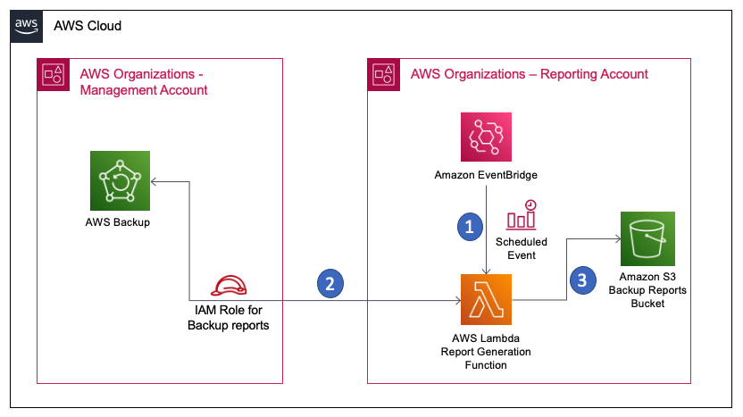

# AWS Backup report generator
## **Summary**

Organisations leverage AWS backup to automate the centralised backup of resources. However it does not provide an out of the box solution to have a consolidated report outside the Management account of the AWS Organization. Operations, development and support teams are not given access to the Management account. Bringing this reporting outside the Management account reduces the effort for Auditing and also increases the scope for automations, notifications and alerting.

This pattern depicts the usage of a custom solution to generate consolidated report of the backup jobs that are configured in an AWS Organization. The reports are categorised based on the status of the backup jobs. and this helps in the easy integration of automations based on the statuses.

## **Prerequisites**

-   An active AWS organization setup having a minimum of

    -   Management Account

    -   Reporting Account (Any AWS account within the AWS Organization where the reports are generated)

-   AWS IAM user/roles with the required access and permissions for deploying the solution in the above mentioned accounts.

-   AWS Backup service already configured at organization level. (Refer this documentation for detailed implementation guide for [Centralised Backup solution](https://aws.amazon.com/blogs/storage/automate-centralized-backup-at-scale-across-aws-services-using-aws-backup/))

## **Limitations**

The report generated are only for the resources for which backup is enabled through the AWS Backup service at an organization level, but it cannot identify those resources for which backup is not enabled.

## **Target architecture**

-   The scheduled event rule triggers the lambda function in the Reporting account daily at 11.59PM UTC time.

-   The Lambda function uses STS assume role to connect to the Management account, and pulls the backup report for the last 24 hours.

-   The lambda function then

    -   Categorize the result based on status

    -   Convert the response to csv results based on status

    -   Upload the results in the backup reports S3 bucket in folders created based on date.

## **Tools**

-   [Amazon EventBridge rules](https://docs.aws.amazon.com/eventbridge/latest/userguide/eb-rules.html) - A rule matches incoming events and sends them to targets for processing. A single rule can send an event to multiple targets, which then run in parallel. Rules are based either on an event pattern or a schedule.

-   [AWS Lambda](https://aws.amazon.com/lambda/) - AWS Lambda is a serverless, event-driven compute service that lets you run code for virtually any type of application or backend service without provisioning or managing servers.

-   [AWS Identity and Access Management (IAM)](https://aws.amazon.com/iam/) – AWS IAM helps you to manage access to AWS services and resources securely.

-   [AWS CloudFormation](https://aws.amazon.com/cloudformation/) – AWS CloudFormation is an infrastructure as code (IaC) service that allows you to easily model, provision, and manage AWS and third-party resources.

-   [Amazon S3](https://aws.amazon.com/s3/) – Amazon Simple Storage Service (Amazon S3) is storage for the internet.

## **Steps to Deploy**

1. Clone this repository to local workstation
2. Deploy template-management.yml to the management account of the AWS Organization
3. Deploy template-reporting.yml to the reporting account where you want the reports to be generated.

## Security

See [CONTRIBUTING](CONTRIBUTING.md#security-issue-notifications) for more information.

## License

This library is licensed under the MIT-0 License. See the LICENSE file.

